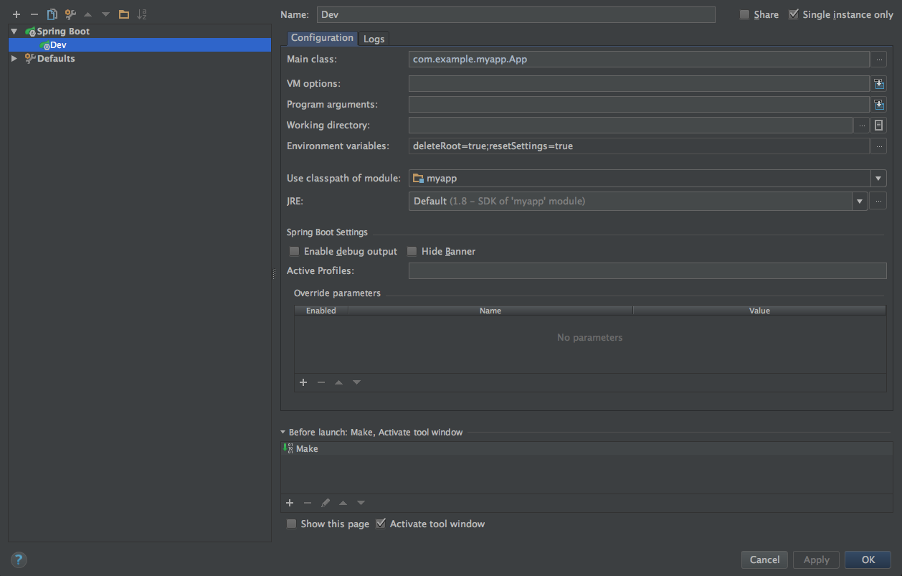

[](https://www.youtube.com/watch?v=qRC4Vk6kisY)

# SpringBoot Kickstart

is a Yeoman generator that creates a basic SpringBoot application with basic authentication, Thymeleaf, `javax.mail` and MongoDB. Bootstrap 4 (alpha 2) is used on the frontend side. 
Since v1.0.1 you can choose between Bootstrap 4 and 3.3.6 but **keep in mind** that the frontend HTML is still for Bootstrap 4 and may look shitty.

It has absolutely nothing to do with [Kickstart](http://getkickstart.com/) but was inspired by [Bootstrap Kickstart](https://github.com/micromata/bootstrap-kickstart).

## Table of Contents

- [Quick install guide](#quick-install-guide)
- [Running the app](#running)

## Quick install guide

You need to have [Node.js](https://nodejs.org) installed.

	$ npm install -g yo
	$ npm install -g generator-springboot-kickstart
	$ yo springboot-kickstart

## Running

1. Create directories for mongodb: `$ mkdir data && mkdir data/db && mkdir log`
2. Create keystore: `$ ./generateKeygen.sh` (chmod it, if it's not executable)
3. Update settings in `/src/main/resources/application.properties`
4. Start MongoDB: `$ mongod --config mongodb.conf`
5. Start the webapp (instructions for IntelliJ below, for cmdline use google)

I recommend setting the following environment variables when developing:

```
deleteRoot=true
resetSettings=true
```

When using those, you'll have a clean setup after every build and a new root user is created every launch.

### Using IntelliJ IDEA

The generated app can run without problems using the following run configuration:


